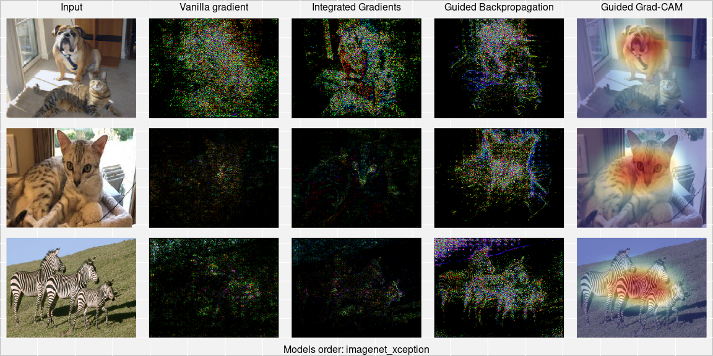

sauron
======

<!-- badges: start -->

[](https://codecov.io/gh/maju116/sauron)
<!-- badges: end -->

**Explainable Artificial Intelligence (XAI) for Neutral Networks in
tensorflow/keras.**

With `sauron` you can use Explainable Artificial Intelligence (XAI)
methods to understand predictions made by Neural Networks in
`tensorflow/keras`. For the time being only Convolutional Neural
Networks are supported, but it will change in time.

How to install?
---------------

You can install the latest version of `sauron` with `remotes`:

``` r
remotes::install_github("maju116/sauron")
```

(`main` branch contains the stable version. Use `develop` branch for
latest features)

To install [previous versions]() you can run:

``` r
remotes::install_github("maju116/sauron", ref = "0.1.0")
```

In order to install `sauron` you need to install `keras` and
`tensorflow` packages and `Tensorflow` version `>= 2.0.0`
(`Tensorflow 1.x` will not be supported!)

How to use it?
--------------

To generate any explanations you will have to create an object of class
`CNNexplainer`. To do this you will need two things:

-   tensorflow/keras model
-   image preprocessing function (optional)

``` r
library(tidyverse)
library(sauron)

model <- application_xception()
preprocessing_function <- xception_preprocess_input

explainer <- CNNexplainer$new(model = model,
                              preprocessing_function = preprocessing_function,
                              id = "imagenet_xception")
explainer
#> <CNNexplainer>
#>   Public:
#>     clone: function (deep = FALSE) 
#>     explain: function (input_imgs_paths, class_index = NULL, methods = c("V", 
#>     id: imagenet_xception
#>     initialize: function (model, preprocessing_function, id = NULL) 
#>     model: function (object, ...) 
#>     preprocessing_function: function (x) 
#>     show_available_methods: function () 
#>   Private:
#>     available_methods: tbl_df, tbl, data.frame
```

To see available XAI methods for the `CNNexplainer` object use:

``` r
explainer$show_available_methods()
#> # A tibble: 8 x 2
#>   method name                  
#>   <chr>  <chr>                 
#> 1 V      Vanilla gradient      
#> 2 GI     Gradient x Input      
#> 3 SG     SmoothGrad            
#> 4 SGI    SmoothGrad x Input    
#> 5 IG     Integrated Gradients  
#> 6 GB     Guided Backpropagation
#> 7 OCC    Occlusion Sensitivity 
#> 8 GGC    Guided Grad-CAM
```

Now you can explain predictions using `explain` method. You will need:

-   paths to the images for which you want to generate explanations.
-   class indexes for which the explanations should be generated
    (optional, if set to `NULL` class that maximizes predicted
    probability will be found for each image).
-   character vector with method names (optional, by default explainer
    will use all methods).
-   batch size (optional, by default number of inserted images).
-   additional arguments with settings for a specific method (optional).

As an output you will get an object of class `CNNexplanations`:

``` r
input_imgs_paths <- list.files(system.file("extdata", "images", package = "sauron"), full.names = TRUE)

explanations <- explainer$explain(input_imgs_paths = input_imgs_paths,
                                  class_index = NULL,
                                  methods = c("V", "IG",  "GB", "GGC"),
                                  steps = 10, # Number of Integrated Gradients steps
                                  grayscale = FALSE # RGB or Gray gradients
)

explanations
#> CNNexplanations object contains explanations for 2 images for 1 model.
```

You can get raw explanations and metadata from `CNNexplanations` object
using:

``` r
explanations$get_metadata()
#> $multimodel_explanations
#> [1] FALSE
#> 
#> $ids
#> [1] "imagenet_xception"
#> 
#> $n_models
#> [1] 1
#> 
#> $target_sizes
#> $target_sizes[[1]]
#> [1] 299 299   3
#> 
#> 
#> $methods
#> [1] "V"   "IG"  "GB"  "GGC"
#> 
#> $input_imgs_paths
#> [1] "/home/maju116/R/x86_64-pc-linux-gnu-library/4.0/sauron/extdata/images/cat.jpeg"  
#> [2] "/home/maju116/R/x86_64-pc-linux-gnu-library/4.0/sauron/extdata/images/zebras.jpg"
#> 
#> $n_imgs
#> [1] 2

raw_explanations <- explanations$get_explanations()
str(raw_explanations)
#> List of 1
#>  $ imagenet_xception:List of 5
#>   ..$ Input: num [1:2, 1:299, 1:299, 1:3] 134 170 134 168 134 170 135 168 135 167 ...
#>   .. ..- attr(*, "dimnames")=List of 4
#>   .. .. ..$ : NULL
#>   .. .. ..$ : NULL
#>   .. .. ..$ : NULL
#>   .. .. ..$ : NULL
#>   ..$ V    : int [1:2, 1:299, 1:299, 1:3] 0 0 0 0 0 0 0 0 0 0 ...
#>   .. ..- attr(*, "dimnames")=List of 4
#>   .. .. ..$ : NULL
#>   .. .. ..$ : NULL
#>   .. .. ..$ : NULL
#>   .. .. ..$ : NULL
#>   ..$ IG   : int [1:2, 1:299, 1:299, 1:3] 0 0 0 0 0 0 0 0 0 0 ...
#>   .. ..- attr(*, "dimnames")=List of 4
#>   .. .. ..$ : NULL
#>   .. .. ..$ : NULL
#>   .. .. ..$ : NULL
#>   .. .. ..$ : NULL
#>   ..$ GB   : int [1:2, 1:299, 1:299, 1:3] 0 2 0 111 0 28 0 151 0 231 ...
#>   .. ..- attr(*, "dimnames")=List of 4
#>   .. .. ..$ : NULL
#>   .. .. ..$ : NULL
#>   .. .. ..$ : NULL
#>   .. .. ..$ : NULL
#>   ..$ GGC  : num [1:2, 1:299, 1:299, 1] 0 0.000455 0 0.000455 0 ...
#>   .. ..- attr(*, "dimnames")=List of 4
#>   .. .. ..$ : NULL
#>   .. .. ..$ : NULL
#>   .. .. ..$ : NULL
#>   .. .. ..$ : NULL
```

To visualize and save generated explanations use:

``` r
explanations$plot_and_save(combine_plots = TRUE, # Show all explanations side by side on one image?
                           output_path = NULL, # Where to save output(s)
                           plot = TRUE # Should output be plotted?
)
```



If you want to compare two or more different models you can do it by
combining `CNNexplainer` objects into `CNNexplainers` object:

``` r
model2 <- application_densenet121()
preprocessing_function2 <- densenet_preprocess_input

explainer2 <- CNNexplainer$new(model = model2,
                               preprocessing_function = preprocessing_function2,
                               id = "imagenet_densenet121")

model3 <- application_densenet201()
preprocessing_function3 <- densenet_preprocess_input

explainer3 <- CNNexplainer$new(model = model3,
                               preprocessing_function = preprocessing_function3,
                               id = "imagenet_densenet201")

explainers <- CNNexplainers$new(explainer, explainer2, explainer3)

explanations123 <- explainers$explain(input_imgs_paths = input_imgs_paths,
                                      class_index = NULL,
                                      methods = c("V", "IG",  "GB", "GGC"),
                                      steps = 10,
                                      grayscale = FALSE
)

explanations123$get_metadata()
#> $multimodel_explanations
#> [1] TRUE
#> 
#> $ids
#> [1] "imagenet_xception"    "imagenet_densenet121" "imagenet_densenet201"
#> 
#> $n_models
#> [1] 3
#> 
#> $target_sizes
#> $target_sizes[[1]]
#> [1] 299 299   3
#> 
#> $target_sizes[[2]]
#> [1] 224 224   3
#> 
#> $target_sizes[[3]]
#> [1] 224 224   3
#> 
#> 
#> $methods
#> [1] "V"   "IG"  "GB"  "GGC"
#> 
#> $input_imgs_paths
#> [1] "/home/maju116/R/x86_64-pc-linux-gnu-library/4.0/sauron/extdata/images/cat.jpeg"  
#> [2] "/home/maju116/R/x86_64-pc-linux-gnu-library/4.0/sauron/extdata/images/zebras.jpg"
#> 
#> $n_imgs
#> [1] 2

explanations123$plot_and_save(combine_plots = TRUE,
                              output_path = NULL,
                              plot = TRUE
)
```


Alternatively if you already have some `CNNexplanations` objects
generated (for the same images and using same methods) you can combine
them:

``` r
explanations2 <- explainer2$explain(input_imgs_paths = input_imgs_paths,
                                    class_index = NULL,
                                    methods = c("V", "IG",  "GB", "GGC"),
                                    steps = 10,
                                    grayscale = FALSE
)

explanations3 <- explainer3$explain(input_imgs_paths = input_imgs_paths,
                                    class_index = NULL,
                                    methods = c("V", "IG",  "GB", "GGC"),
                                    steps = 10,
                                    grayscale = FALSE
)

explanations$combine(explanations2, explanations3)

explanations$get_metadata()
#> $multimodel_explanations
#> [1] TRUE
#> 
#> $ids
#> [1] "imagenet_xception"    "imagenet_densenet121" "imagenet_densenet201"
#> 
#> $n_models
#> [1] 3
#> 
#> $target_sizes
#> $target_sizes[[1]]
#> [1] 299 299   3
#> 
#> $target_sizes[[2]]
#> [1] 224 224   3
#> 
#> $target_sizes[[3]]
#> [1] 224 224   3
#> 
#> 
#> $methods
#> [1] "V"   "IG"  "GB"  "GGC"
#> 
#> $input_imgs_paths
#> [1] "/home/maju116/R/x86_64-pc-linux-gnu-library/4.0/sauron/extdata/images/cat.jpeg"  
#> [2] "/home/maju116/R/x86_64-pc-linux-gnu-library/4.0/sauron/extdata/images/zebras.jpg"
#> 
#> $n_imgs
#> [1] 2

explanations$plot_and_save(combine_plots = TRUE,
                           output_path = NULL,
                           plot = TRUE
)
```


