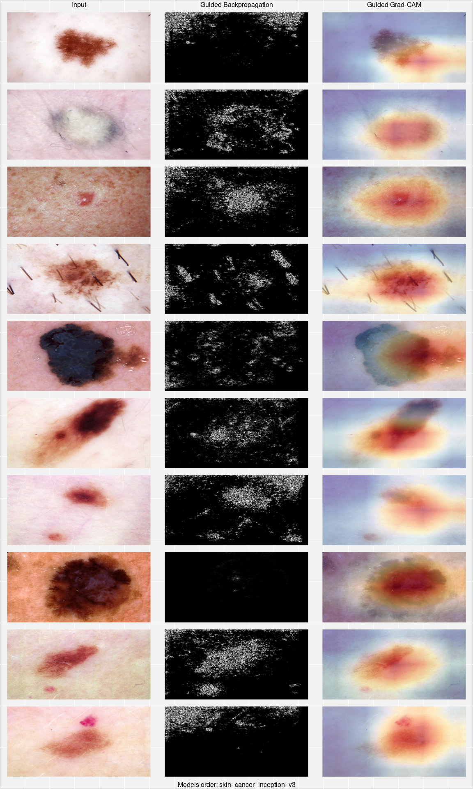

Download images: [Skin Cancer
dataset](https://www.kaggle.com/fanconic/skin-cancer-malignant-vs-benign).

Build Convolutional Neural Network(s) for skin cancer classification:

``` r
library(tidyverse)
library(sauron)
library(here)

skin_cancer_path <- here("examples/data/skin_cancer/")
models_path <- here("examples/models/")

train_path <- file.path(skin_cancer_path, "train/")
test_path <- file.path(skin_cancer_path, "test/")
```

``` r
train_datagen <- image_data_generator(
  rescale = 1/255,
  rotation_range = 10,
  width_shift_range = 0.1,
  height_shift_range = 0.1,
  zoom_range = 0.1,
  horizontal_flip = FALSE
)

validation_datagen <- image_data_generator(rescale = 1/255)

train_flow <- flow_images_from_directory(
  directory = train_path,
  generator = train_datagen,
  color_mode = "rgb",
  target_size = c(224, 224),
  batch_size = 64,
  class_mode = "categorical"
)

validation_flow <- flow_images_from_directory(
  directory = test_path,
  generator = validation_datagen,
  color_mode = "rgb",
  target_size = c(224, 224),
  batch_size = 64,
  class_mode = "categorical"
)

base_model <- application_inception_v3(
  include_top = FALSE,
  input_shape = c(224, 224, 3),
  pooling = NULL, classes = 2,
  weights = 'imagenet')

predictions <- base_model$output %>%
  layer_flatten() %>%
  layer_dense(units = 512, activation = "relu") %>%
  layer_dropout(0.4) %>%
  layer_batch_normalization() %>%
  layer_dense(units = 256, activation = "relu") %>%
  layer_dropout(0.4) %>%
  layer_batch_normalization() %>%
  layer_dense(units = 2, activation = "softmax")

skin_cancer_model <- keras_model(inputs = base_model$input, outputs = predictions)

skin_cancer_model %>% compile(
  loss = "categorical_crossentropy",
  optimizer = optimizer_rmsprop(lr = 1e-5),
  metrics = c("accuracy"))

model_checkpoint <- callback_model_checkpoint(filepath = file.path(models_path, "skin_cancer.h5"),
                                              monitor = "val_accuracy",
                                              save_best_only = TRUE,
                                              verbose = 1
)
early_stopping <- callback_early_stopping(monitor = "val_accuracy", patience = 5)

history <- skin_cancer_model %>% fit_generator(
  train_flow, 
  steps_per_epoch = 42,
  epochs = 50,
  validation_data = validation_flow,
  validation_steps = 11,
  callbacks = list(model_checkpoint, early_stopping)
)
```

Now we can explore and explain some of the predictions. First step is to
create an explainer:

``` r
skin_cancer_model <- load_model_hdf5(file.path(models_path, "skin_cancer.h5"))

image_scale <- function(image) image / 255

skin_cancer_explainer <- CNNexplainer$new(
  model = skin_cancer_model,
  preprocessing_function = image_scale,
  id = "skin_cancer_inception_v3"
)

skin_cancer_explainer$show_available_methods()
```

    ## # A tibble: 8 x 2
    ##   method name                  
    ##   <chr>  <chr>                 
    ## 1 V      Vanilla gradient      
    ## 2 GI     Gradient x Input      
    ## 3 SG     SmoothGrad            
    ## 4 SGI    SmoothGrad x Input    
    ## 5 IG     Integrated Gradients  
    ## 6 GB     Guided Backpropagation
    ## 7 OCC    Occlusion Sensitivity 
    ## 8 GGC    Guided Grad-CAM

Let’s take a look at some test images:

``` r
set.seed(1234)
sample_test_images <- sample(list.files(test_path, full.names = TRUE, recursive = TRUE), 10)

test_explanations <- skin_cancer_explainer$explain(
  input_imgs_paths = sample_test_images,
  class_index = NULL,
  methods = c("GB", "GGC")
)

test_predictions <- predict(skin_cancer_model, image_scale(test_explanations$get_explanations()$skin_cancer_inception_v3$Input)) %>%
  as.data.frame() %>%
  transmute(malignant_probability = V2) %>%
  mutate(malignant = grepl("malignant", sample_test_images))

test_predictions
```

    ##    malignant_probability malignant
    ## 1           0.3019230664     FALSE
    ## 2           0.6327537894     FALSE
    ## 3           0.9552918673      TRUE
    ## 4           0.9418284297      TRUE
    ## 5           0.9997642636      TRUE
    ## 6           0.0003123278     FALSE
    ## 7           0.0025081602     FALSE
    ## 8           0.9999947548      TRUE
    ## 9           0.3534385562     FALSE
    ## 10          0.0102499994     FALSE

``` r
test_explanations$plot_and_save(combine_plots = TRUE,
                           output_path = NULL,
                           plot = TRUE
)
```


